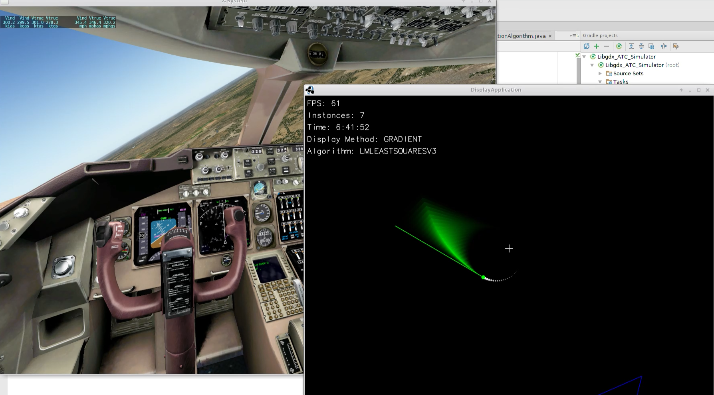

    
    <strong>| <a href="https://kellpossible.github.io/libgdx-atc-sim/xplane_ADSB_Output/xplane_ADSB_Output.html">Project Documentation</a></strong>

# x-plane ADSB output
This project was small subset of the code I wrote for my undergraduate final
year software project [libgdx-atc-sim](https://github.com/kellpossible/libgdx-atc-sim).

This is a plugin for the [x-plane](http://www.x-plane.com/) flight simulator
which sends flight data equivalent to what might be present in an ADSB message
via sockets over the network to a server capable of receiving the messages.

The original purpose was for this to be used as a realtime, high frequency data
source for simulating air traffic control situations and algorithms. 

The message format, which uses Google Protocol Buffers can be found in
[DebugDataFeedServe.proto](adsb_output/DebugDataFeedServe.proto).

This plugin to be used with Sandy Barbour's python interface for x-plane. See
http://www.xpluginsdk.org/python_interface.htm for more info. The version of
python required is 2.7, and the
[protobuf](https://pypi.python.org/pypi/protobuf/3.5.1) 
module is required to be installed in your python distribution.

Running x-plane and [libgdx-atc-sim](https://github.com/kellpossible/libgdx-atc-sim) connected with each other

A couple of videos are available on YouTube showing this script in operation:

 + [Testing with an f-22 fighter jet](https://www.youtube.com/watch?v=U8mXVNskZf8)
 + [Testing with a Boeing 747](https://www.youtube.com/watch?v=oC8Hk0qTTlk)

Further description can be found in the project documentation page [X-Plane ADSB Output Plugin](https://kellpossible.github.io/libgdx-atc-sim/xplane_ADSB_Output/xplane_ADSB_Output.html)